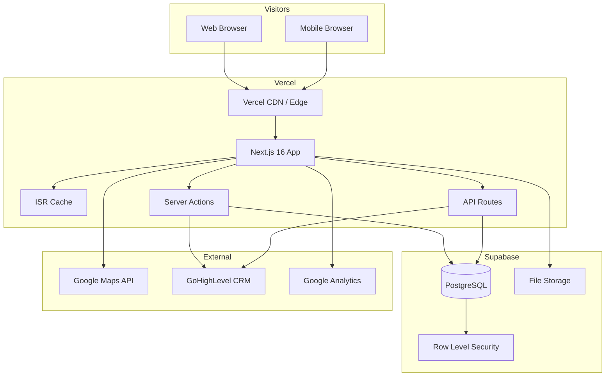
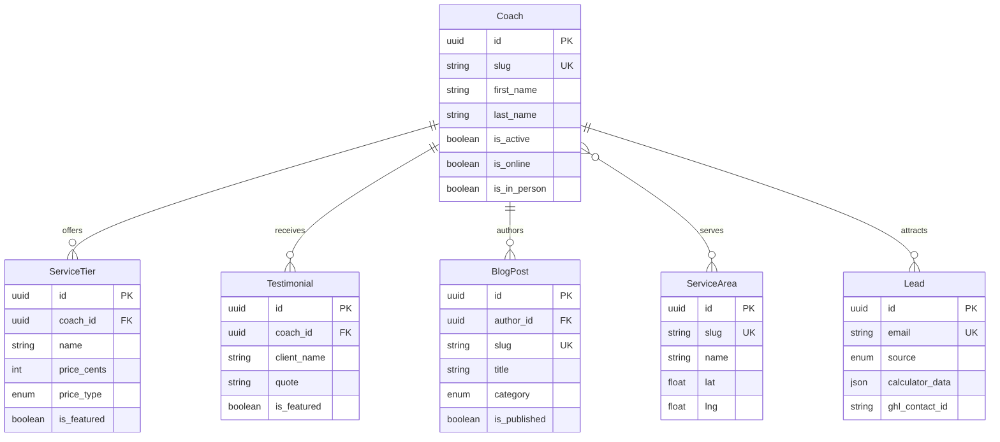
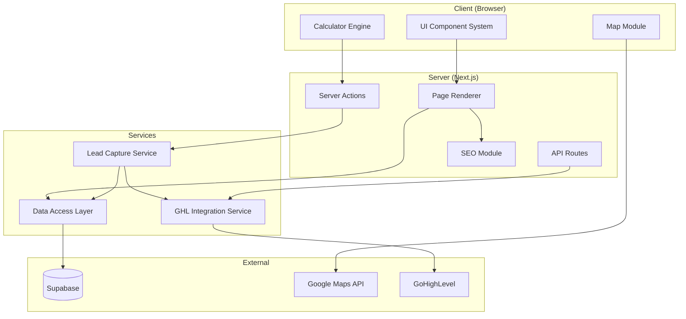
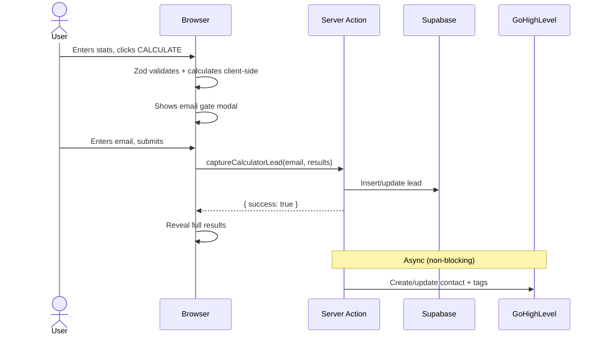
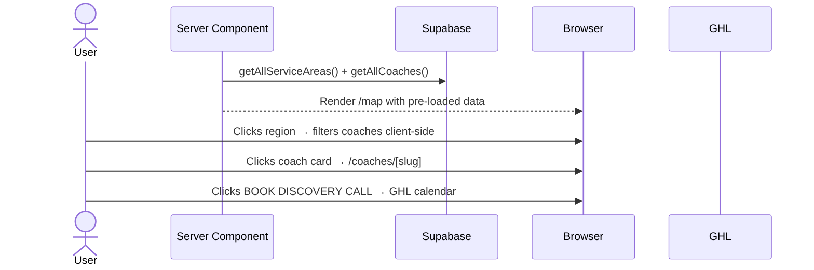
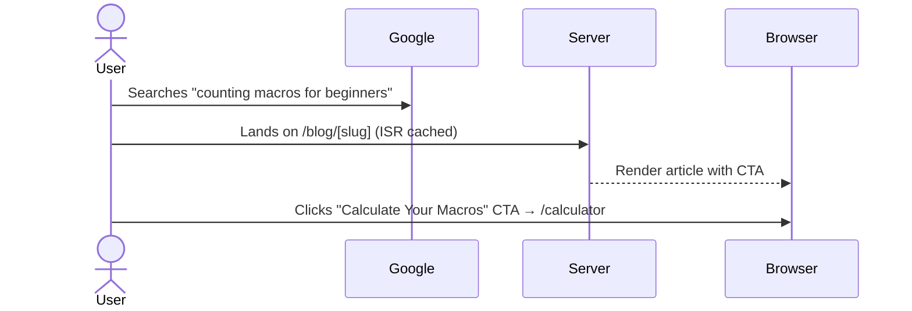
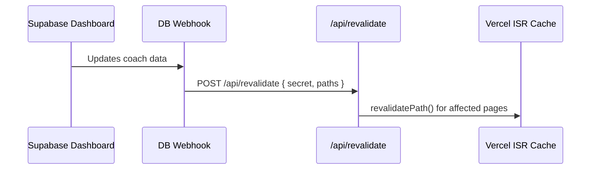

# Eccentric Iron Fitness v2 — Fullstack Architecture Document

**Last Updated:** March 15, 2026
**Phase:** Design (SOP Phase 3)
**Agent:** Winston (Architect)

---

## 1. Introduction

This document outlines the complete fullstack architecture for Eccentric Iron Fitness v2, including backend systems, frontend implementation, and their integration. It serves as the single source of truth for AI-driven development, ensuring consistency across the entire technology stack.

**Starter Template:** N/A — Greenfield project. Scaffolded with `create-next-app` (Next.js 16 + Tailwind 4 + TypeScript).

**Key Input Documents:**
- `docs/BUSINESS_PROFILE.md` — Multi-coach platform, service tiers, geographic strategy
- `docs/KEYWORD_REPORT.md` — SEO keyword targets and content strategy
- `docs/front-end-spec.md` — Brutalist UI/UX spec, component library, user flows, wireframes

| Date | Version | Description | Author |
|------|---------|-------------|--------|
| 2026-03-15 | 1.0 | Initial fullstack architecture | Winston (Architect) |

---

## 2. High-Level Architecture

### 2.1 Technical Summary

Eccentric Iron Fitness v2 is a server-rendered Next.js 16 application deployed on Vercel, using Supabase (PostgreSQL) for data persistence, auth, and file storage. The architecture follows the Jamstack + serverless pattern — static pages generated at build time via ISR, with server actions and API routes handling dynamic operations (form submissions, GHL webhooks, email capture). Google Maps JavaScript API provides the interactive BC map for coach discovery, loaded client-side via dynamic import. GoHighLevel (GHL) serves as the CRM layer via webhook integration for lead capture, booking, and email nurture sequences. The architecture is designed for multi-coach scalability — every data model, route, and component supports N coaches without structural changes.

### 2.2 Platform and Infrastructure

**Platform:** Vercel + Supabase

**Key Services:**
- **Vercel** — Hosting, CDN, edge functions, ISR, preview deployments
- **Supabase** — PostgreSQL database, Row Level Security, file storage (coach photos), edge functions if needed
- **Google Maps** — Interactive map tiles, geocoding, region boundaries
- **GoHighLevel** — CRM, calendar booking, email/SMS automation, webhooks
- **Google Fonts** — Space Grotesk, Inter, JetBrains Mono

**Deployment Regions:** Vercel auto (closest edge), Supabase project `wejlwvfivaiyojxcfiwa`

### 2.3 Repository Structure

**Structure:** Single Next.js App Router application (no monorepo)

**Rationale:** This is a single deployable application. Next.js App Router co-locates frontend and backend (server components, server actions, API routes). A monorepo adds complexity without benefit at this scale.

### 2.4 High-Level Architecture Diagram



### 2.5 Architectural Patterns

- **Jamstack + ISR:** Static generation with incremental revalidation. Pages pre-rendered at build time, revalidated on schedule (1hr static, 15min coach profiles). _Rationale:_ Fastest page loads for SEO with near-real-time data freshness.

- **Server Components First:** All pages are React Server Components by default. Client components only where interactivity is required (map, calculator, mobile nav). _Rationale:_ Minimizes client-side JS bundle.

- **Server Actions for Mutations:** Form submissions use Next.js Server Actions. _Rationale:_ Type-safe, co-located with components, no separate API endpoint needed.

- **API Routes for Webhooks:** GHL webhook callbacks use API routes. _Rationale:_ Webhooks need stable URLs and are initiated externally.

- **Repository Pattern for Data Access:** All Supabase queries go through `lib/db/`. _Rationale:_ Centralizes query logic, enables caching, protects against API changes.

- **Content-Driven Routing:** Dynamic routes with `generateStaticParams()` for SSG. _Rationale:_ New coaches/cities/posts automatically get pages on revalidation.

---

## 3. Tech Stack

| Category | Technology | Version | Purpose | Rationale |
|----------|-----------|---------|---------|-----------|
| Frontend Language | TypeScript | 5.x | Type-safe development | Catches bugs at compile time |
| Frontend Framework | Next.js | 16.1.6 | SSR/SSG/ISR, App Router | Best-in-class for SEO on Vercel |
| UI Library | React | 19.2.3 | Component rendering | Required by Next.js 16 |
| UI Components | Custom Brutalist | N/A | All UI components | Full aesthetic control |
| CSS Framework | Tailwind CSS | 4.x | Utility-first styling | Design system via config |
| State Management | Server Components + useState | N/A | Minimal client state | Most state lives on server |
| Animation | Framer Motion | 12.36.0 | Micro-interactions | Tree-shakeable, useReducedMotion |
| Icons | Lucide React | 0.577.0 | Functional UI icons | Tree-shakeable, 2px stroke |
| Validation | Zod | 4.3.6 | Form + server validation | Works on client and server |
| Utilities | clsx + tailwind-merge | latest | Conditional classes | Prevents Tailwind conflicts |
| Maps | Google Maps JavaScript API | 3.x | Interactive BC map | Best Canadian address data |
| Maps React | @vis.gl/react-google-maps | latest | React bindings | Google's official library |
| Backend Language | TypeScript | 5.x | Server actions + API routes | Shared types frontend/backend |
| Backend Framework | Next.js Server Actions + API Routes | 16.1.6 | Mutations, webhooks | No separate server needed |
| Database | Supabase (PostgreSQL) | 15.x | Relational data, RLS | Clean v2 instance |
| File Storage | Supabase Storage | N/A | Coach photos, blog images | Same platform as database |
| Authentication | Supabase Auth | N/A | Admin/coach login (future) | Built into Supabase |
| CRM | GoHighLevel | N/A | Lead capture, booking | Existing integration |
| Frontend Testing | Vitest | latest | Unit/component tests | Fast, Jest-compatible |
| E2E Testing | Playwright | latest | Full browser testing | Cross-browser, best Next.js support |
| Backend Testing | Vitest | latest | Server action/API tests | One test runner |
| Build Tool | Next.js (Turbopack) | 16.1.6 | Dev and production builds | Built-in fast rebuilds |
| Linting | ESLint | 9.x | Code quality | eslint-config-next included |
| CI/CD | GitHub Actions | N/A | Lint, test, type-check on PR | Free, triggers Vercel deploy |
| Hosting | Vercel | N/A | Deployment, CDN, edge | Native Next.js host |
| Monitoring | Vercel Analytics + Speed Insights | N/A | Core Web Vitals, traffic | Zero config |
| Fonts | Google Fonts (next/font) | N/A | Typography | Self-hosted, no FOUT |

---

## 4. Data Models

### 4.1 Coach

```typescript
interface Coach {
  id: string;
  slug: string;
  first_name: string;
  last_name: string;
  email: string;
  phone: string | null;
  bio: string;
  approach: string;
  photo_url: string | null;
  certifications: string[];
  specialties: string[];
  is_active: boolean;
  is_online: boolean;
  is_in_person: boolean;
  founding_rate_remaining: number | null;
  social_links: { instagram?: string; tiktok?: string; youtube?: string };
  sort_order: number;
  created_at: string;
  updated_at: string;
}
```

**Relationships:** Has many ServiceTier (1:N), Testimonial (1:N), CoachServiceArea (M:N), BlogPost (1:N as author)

### 4.2 ServiceTier

```typescript
interface ServiceTier {
  id: string;
  coach_id: string;
  name: string;
  slug: string;
  description: string;
  price_cents: number;
  price_type: 'one_time' | 'monthly' | 'per_session';
  features: string[];
  exclusions: string[];
  is_featured: boolean;
  cta_label: string;
  cta_url: string;
  sort_order: number;
  is_active: boolean;
}
```

### 4.3 ServiceArea

```typescript
interface ServiceArea {
  id: string;
  name: string;
  slug: string;
  province: string;
  lat: number;
  lng: number;
  boundary_geojson: GeoJSON.Polygon | null;
  seo_title: string;
  seo_description: string;
  content: string;
  monthly_search_volume: number | null;
  is_active: boolean;
}
```

### 4.4 CoachServiceArea (Join)

```typescript
interface CoachServiceArea {
  coach_id: string;
  service_area_id: string;
  is_primary: boolean;
}
```

### 4.5 Testimonial

```typescript
interface Testimonial {
  id: string;
  coach_id: string;
  client_name: string;
  client_location: string | null;
  quote: string;
  result_summary: string | null;
  is_featured: boolean;
  sort_order: number;
  is_active: boolean;
  created_at: string;
}
```

### 4.6 BlogPost

```typescript
interface BlogPost {
  id: string;
  slug: string;
  title: string;
  excerpt: string;
  content: string;
  category: 'fat_loss' | 'nutrition' | 'training' | 'lifestyle';
  author_id: string;
  cover_image_url: string | null;
  seo_title: string;
  seo_description: string;
  read_time_minutes: number;
  is_published: boolean;
  published_at: string | null;
  created_at: string;
  updated_at: string;
}
```

### 4.7 Lead

```typescript
interface Lead {
  id: string;
  email: string;
  source: 'calculator' | 'contact_form' | 'newsletter' | 'waitlist';
  calculator_data: {
    tdee: number;
    protein_g: number;
    carbs_g: number;
    fat_g: number;
    goal: string;
  } | null;
  ghl_contact_id: string | null;
  coach_id: string | null;
  created_at: string;
}
```

### 4.8 Entity Relationship Diagram



---

## 5. API Specification

### 5.1 Server Actions (`app/actions/`)

```typescript
// Lead Capture
async function captureCalculatorLead(data: {
  email: string; tdee: number; protein_g: number;
  carbs_g: number; fat_g: number; goal: string;
}): Promise<{ success: boolean; error?: string }>

async function captureEmail(data: {
  email: string; source: 'newsletter' | 'waitlist'; coach_id?: string;
}): Promise<{ success: boolean; error?: string }>

// Contact Form
async function submitContactForm(data: {
  name: string; email: string; phone?: string;
  message: string; coach_id?: string;
}): Promise<{ success: boolean; error?: string }>
```

### 5.2 Data Fetching (Server Components)

```typescript
async function getCoaches(): Promise<Coach[]>
async function getCoachBySlug(slug: string): Promise<CoachWithRelations | null>
async function getServiceAreas(): Promise<ServiceArea[]>
async function getServiceAreaBySlug(slug: string): Promise<ServiceAreaWithCoaches | null>
async function getCoachesByArea(areaId: string): Promise<Coach[]>
async function getBlogPosts(options?: { category?: string; limit?: number; offset?: number }): Promise<{ posts: BlogPost[]; total: number }>
async function getBlogPostBySlug(slug: string): Promise<BlogPostWithAuthor | null>
async function getFeaturedTestimonials(): Promise<(Testimonial & { coach: Coach })[]>
```

### 5.3 API Routes (`app/api/`)

```typescript
// POST /api/webhooks/ghl/booking — GHL booking callback
// POST /api/webhooks/ghl/contact-update — GHL contact sync
// POST /api/revalidate — On-demand ISR revalidation (secret-protected)
```

### 5.4 Data Access Layer (`lib/db/`)

All database queries centralized. Components never call Supabase directly.

---

## 6. System Components

### 6.1 Page Renderer — Server Components, ISR, `generateMetadata()`
### 6.2 UI Component System — Brutalist design system primitives
### 6.3 Map Module — Google Maps, client-side, dynamic import
### 6.4 Calculator Engine — Pure client-side math, server action for email capture
### 6.5 Lead Capture Service — Validates, stores in DB, syncs to GHL async
### 6.6 GHL Integration Service — Contact creation, tagging, webhook handling
### 6.7 SEO Module — Metadata, JSON-LD, sitemap, robots.txt

### Component Diagram



---

## 7. External APIs

### 7.1 Google Maps JavaScript API
- **Purpose:** Interactive BC map, service area polygons, location search
- **Auth:** API key (domain-restricted) — `NEXT_PUBLIC_GOOGLE_MAPS_API_KEY`
- **APIs Used:** Maps JavaScript API, Places API (New), Geocoding API
- **Rate Limits:** $200/month free credit (~28,000 map loads)

### 7.2 GoHighLevel API
- **Purpose:** CRM — lead capture, contact management, booking, automations
- **Base URL:** `https://services.leadconnectorhq.com`
- **Auth:** API key — `GHL_API_KEY` (server-side only)
- **Location ID:** `z3m4mhravHce78P6jW12`
- **Rate Limits:** 100 req/min per location
- **Key Endpoints:** POST /contacts/, PUT /contacts/{id}, POST /contacts/{id}/tags

### 7.3 Supabase
- **Purpose:** PostgreSQL database, file storage, auth (future)
- **Project URL:** `https://wejlwvfivaiyojxcfiwa.supabase.co`
- **Auth:** Anon key (client, RLS-protected), service role key (server, full access)

---

## 8. Core Workflows

### 8.1 Calculator Lead Capture



### 8.2 Map Discovery → Coach Booking



### 8.3 Blog → Calculator Funnel



### 8.4 On-Demand ISR Revalidation



---

## 9. Database Schema

```sql
-- Enable UUID generation
CREATE EXTENSION IF NOT EXISTS "uuid-ossp";

-- COACHES
CREATE TABLE coaches (
  id UUID PRIMARY KEY DEFAULT uuid_generate_v4(),
  slug TEXT UNIQUE NOT NULL,
  first_name TEXT NOT NULL,
  last_name TEXT NOT NULL,
  email TEXT NOT NULL,
  phone TEXT,
  bio TEXT NOT NULL,
  approach TEXT NOT NULL DEFAULT '',
  photo_url TEXT,
  certifications TEXT[] NOT NULL DEFAULT '{}',
  specialties TEXT[] NOT NULL DEFAULT '{}',
  is_active BOOLEAN NOT NULL DEFAULT true,
  is_online BOOLEAN NOT NULL DEFAULT true,
  is_in_person BOOLEAN NOT NULL DEFAULT false,
  founding_rate_remaining INTEGER,
  social_links JSONB NOT NULL DEFAULT '{}',
  sort_order INTEGER NOT NULL DEFAULT 0,
  created_at TIMESTAMPTZ NOT NULL DEFAULT NOW(),
  updated_at TIMESTAMPTZ NOT NULL DEFAULT NOW()
);

CREATE INDEX idx_coaches_slug ON coaches(slug);
CREATE INDEX idx_coaches_active ON coaches(is_active) WHERE is_active = true;

-- SERVICE TIERS
CREATE TABLE service_tiers (
  id UUID PRIMARY KEY DEFAULT uuid_generate_v4(),
  coach_id UUID NOT NULL REFERENCES coaches(id) ON DELETE CASCADE,
  name TEXT NOT NULL,
  slug TEXT NOT NULL,
  description TEXT NOT NULL DEFAULT '',
  price_cents INTEGER NOT NULL,
  price_type TEXT NOT NULL CHECK (price_type IN ('one_time', 'monthly', 'per_session')),
  features TEXT[] NOT NULL DEFAULT '{}',
  exclusions TEXT[] NOT NULL DEFAULT '{}',
  is_featured BOOLEAN NOT NULL DEFAULT false,
  cta_label TEXT NOT NULL DEFAULT 'Get Started',
  cta_url TEXT NOT NULL DEFAULT '/contact',
  sort_order INTEGER NOT NULL DEFAULT 0,
  is_active BOOLEAN NOT NULL DEFAULT true,
  UNIQUE(coach_id, slug)
);

CREATE INDEX idx_service_tiers_coach ON service_tiers(coach_id);

-- SERVICE AREAS
CREATE TABLE service_areas (
  id UUID PRIMARY KEY DEFAULT uuid_generate_v4(),
  name TEXT NOT NULL,
  slug TEXT UNIQUE NOT NULL,
  province TEXT NOT NULL DEFAULT 'BC',
  lat DOUBLE PRECISION NOT NULL,
  lng DOUBLE PRECISION NOT NULL,
  boundary_geojson JSONB,
  seo_title TEXT NOT NULL DEFAULT '',
  seo_description TEXT NOT NULL DEFAULT '',
  content TEXT NOT NULL DEFAULT '',
  monthly_search_volume INTEGER,
  is_active BOOLEAN NOT NULL DEFAULT true
);

CREATE INDEX idx_service_areas_slug ON service_areas(slug);

-- COACH <> SERVICE AREA (JOIN)
CREATE TABLE coach_service_areas (
  coach_id UUID NOT NULL REFERENCES coaches(id) ON DELETE CASCADE,
  service_area_id UUID NOT NULL REFERENCES service_areas(id) ON DELETE CASCADE,
  is_primary BOOLEAN NOT NULL DEFAULT false,
  PRIMARY KEY (coach_id, service_area_id)
);

-- TESTIMONIALS
CREATE TABLE testimonials (
  id UUID PRIMARY KEY DEFAULT uuid_generate_v4(),
  coach_id UUID NOT NULL REFERENCES coaches(id) ON DELETE CASCADE,
  client_name TEXT NOT NULL,
  client_location TEXT,
  quote TEXT NOT NULL,
  result_summary TEXT,
  is_featured BOOLEAN NOT NULL DEFAULT false,
  sort_order INTEGER NOT NULL DEFAULT 0,
  is_active BOOLEAN NOT NULL DEFAULT true,
  created_at TIMESTAMPTZ NOT NULL DEFAULT NOW()
);

CREATE INDEX idx_testimonials_coach ON testimonials(coach_id);
CREATE INDEX idx_testimonials_featured ON testimonials(is_featured) WHERE is_featured = true;

-- BLOG POSTS
CREATE TABLE blog_posts (
  id UUID PRIMARY KEY DEFAULT uuid_generate_v4(),
  slug TEXT UNIQUE NOT NULL,
  title TEXT NOT NULL,
  excerpt TEXT NOT NULL DEFAULT '',
  content TEXT NOT NULL,
  category TEXT NOT NULL CHECK (category IN ('fat_loss', 'nutrition', 'training', 'lifestyle')),
  author_id UUID NOT NULL REFERENCES coaches(id) ON DELETE RESTRICT,
  cover_image_url TEXT,
  seo_title TEXT NOT NULL DEFAULT '',
  seo_description TEXT NOT NULL DEFAULT '',
  read_time_minutes INTEGER NOT NULL DEFAULT 5,
  is_published BOOLEAN NOT NULL DEFAULT false,
  published_at TIMESTAMPTZ,
  created_at TIMESTAMPTZ NOT NULL DEFAULT NOW(),
  updated_at TIMESTAMPTZ NOT NULL DEFAULT NOW()
);

CREATE INDEX idx_blog_posts_slug ON blog_posts(slug);
CREATE INDEX idx_blog_posts_published ON blog_posts(is_published, published_at DESC) WHERE is_published = true;
CREATE INDEX idx_blog_posts_category ON blog_posts(category) WHERE is_published = true;

-- LEADS
CREATE TABLE leads (
  id UUID PRIMARY KEY DEFAULT uuid_generate_v4(),
  email TEXT UNIQUE NOT NULL,
  source TEXT NOT NULL CHECK (source IN ('calculator', 'contact_form', 'newsletter', 'waitlist')),
  calculator_data JSONB,
  ghl_contact_id TEXT,
  coach_id UUID REFERENCES coaches(id) ON DELETE SET NULL,
  created_at TIMESTAMPTZ NOT NULL DEFAULT NOW()
);

CREATE INDEX idx_leads_email ON leads(email);
CREATE INDEX idx_leads_source ON leads(source);

-- AUTO-UPDATE TIMESTAMPS
CREATE OR REPLACE FUNCTION update_updated_at()
RETURNS TRIGGER AS $$
BEGIN
  NEW.updated_at = NOW();
  RETURN NEW;
END;
$$ LANGUAGE plpgsql;

CREATE TRIGGER coaches_updated_at
  BEFORE UPDATE ON coaches
  FOR EACH ROW EXECUTE FUNCTION update_updated_at();

CREATE TRIGGER blog_posts_updated_at
  BEFORE UPDATE ON blog_posts
  FOR EACH ROW EXECUTE FUNCTION update_updated_at();

-- ROW LEVEL SECURITY
ALTER TABLE coaches ENABLE ROW LEVEL SECURITY;
ALTER TABLE service_tiers ENABLE ROW LEVEL SECURITY;
ALTER TABLE service_areas ENABLE ROW LEVEL SECURITY;
ALTER TABLE coach_service_areas ENABLE ROW LEVEL SECURITY;
ALTER TABLE testimonials ENABLE ROW LEVEL SECURITY;
ALTER TABLE blog_posts ENABLE ROW LEVEL SECURITY;
ALTER TABLE leads ENABLE ROW LEVEL SECURITY;

-- Public read for content tables
CREATE POLICY "Public read coaches" ON coaches FOR SELECT USING (is_active = true);
CREATE POLICY "Public read service_tiers" ON service_tiers FOR SELECT USING (is_active = true);
CREATE POLICY "Public read service_areas" ON service_areas FOR SELECT USING (is_active = true);
CREATE POLICY "Public read coach_service_areas" ON coach_service_areas FOR SELECT USING (true);
CREATE POLICY "Public read testimonials" ON testimonials FOR SELECT USING (is_active = true);
CREATE POLICY "Public read blog_posts" ON blog_posts FOR SELECT USING (is_published = true);

-- Leads: service_role only
CREATE POLICY "Service role manages leads" ON leads FOR ALL USING (auth.role() = 'service_role');

-- Write access: service_role only for all tables
CREATE POLICY "Service role writes coaches" ON coaches FOR INSERT WITH CHECK (auth.role() = 'service_role');
CREATE POLICY "Service role updates coaches" ON coaches FOR UPDATE USING (auth.role() = 'service_role');
CREATE POLICY "Service role writes service_tiers" ON service_tiers FOR INSERT WITH CHECK (auth.role() = 'service_role');
CREATE POLICY "Service role updates service_tiers" ON service_tiers FOR UPDATE USING (auth.role() = 'service_role');
CREATE POLICY "Service role writes service_areas" ON service_areas FOR INSERT WITH CHECK (auth.role() = 'service_role');
CREATE POLICY "Service role updates service_areas" ON service_areas FOR UPDATE USING (auth.role() = 'service_role');
CREATE POLICY "Service role writes testimonials" ON testimonials FOR INSERT WITH CHECK (auth.role() = 'service_role');
CREATE POLICY "Service role updates testimonials" ON testimonials FOR UPDATE USING (auth.role() = 'service_role');
CREATE POLICY "Service role writes blog_posts" ON blog_posts FOR INSERT WITH CHECK (auth.role() = 'service_role');
CREATE POLICY "Service role updates blog_posts" ON blog_posts FOR UPDATE USING (auth.role() = 'service_role');

-- SEED DATA
INSERT INTO coaches (slug, first_name, last_name, email, phone, bio, approach, certifications, specialties, is_active, is_online, is_in_person, founding_rate_remaining, social_links)
VALUES (
  'carver-lloyd', 'Carver', 'Lloyd', 'carver@eccentriciron.ca', '(604) 200-3390',
  'Fat loss and body recomposition specialist in Maple Ridge, BC. BCRPA certified trainer helping real people get real results through consistency, not complexity.',
  'Full body first. Same exercises for 6-8 weeks. Earn complexity through consistency. Cook → Measure → Eat. No tracking apps. No fake timelines.',
  ARRAY['BCRPA Registered Personal Trainer', 'Applied Hypertrophy Specialist', 'Certified Nutrition Coach'],
  ARRAY['fat loss', 'body recomposition', 'applied hypertrophy', 'nutrition coaching'],
  true, true, false, 3,
  '{"instagram": "https://www.instagram.com/eccentriciron"}'::jsonb
);

INSERT INTO service_tiers (coach_id, name, slug, description, price_cents, price_type, features, exclusions, is_featured, cta_label, cta_url, sort_order)
VALUES
  ((SELECT id FROM coaches WHERE slug = 'carver-lloyd'),
   'DIY Fat Loss Program', 'diy-fat-loss',
   'Pre-built training program for self-starters who just need a plan.',
   15000, 'one_time',
   ARRAY['Pre-built full body program (3 days/week)', 'Video exercise library', 'Macro targets via calculator', 'Cook → Measure → Eat framework'],
   ARRAY['Movement assessment', 'Zoom calls', 'Phone/text access', 'Video form reviews', 'Custom program', 'Weekly check-ins'],
   false, 'Get the Program', '/contact', 1),
  ((SELECT id FROM coaches WHERE slug = 'carver-lloyd'),
   'Online Coaching', 'online-coaching',
   'Custom program with weekly 1-on-1 Zoom calls and direct access to your coach.',
   20000, 'monthly',
   ARRAY['Custom full body program', 'Weekly 30-min Zoom calls', 'Video form reviews', 'Direct phone/text access', 'Weekly check-ins', 'Personalized macro targets', 'Movement assessment + custom warm-up'],
   ARRAY[]::TEXT[],
   true, 'Book Discovery Call', '/contact', 2);

INSERT INTO service_areas (name, slug, lat, lng, seo_title, seo_description, monthly_search_volume)
VALUES
  ('Maple Ridge', 'maple-ridge', 49.2193, -122.5984, 'Personal Trainer in Maple Ridge, BC | Eccentric Iron Fitness', 'Find a certified personal trainer in Maple Ridge. Fat loss, body recomposition, and nutrition coaching.', 90),
  ('Langley', 'langley', 49.1044, -122.6608, 'Personal Trainer in Langley, BC | Eccentric Iron Fitness', 'Find a certified personal trainer in Langley. Evidence-based fat loss and body recomposition coaching.', 210),
  ('Coquitlam', 'coquitlam', 49.2838, -122.7932, 'Personal Trainer in Coquitlam, BC | Eccentric Iron Fitness', 'Find a certified personal trainer in Coquitlam. Custom training programs and nutrition coaching.', 170),
  ('Surrey', 'surrey', 49.1913, -122.8490, 'Personal Trainer in Surrey, BC | Eccentric Iron Fitness', 'Find a certified personal trainer in Surrey. Fat loss, muscle building, and online coaching available.', 320);

-- Carver is online-only (province-wide BC). Service areas exist for city page SEO
-- but are NOT linked to Carver. Future in-person coaches will be linked to areas.
-- INSERT INTO coach_service_areas when in-person coaches are onboarded.
```

---

## 10. Frontend Architecture

### 10.1 Component Organization

```
src/components/
├── ui/           # BrutalistButton, FormField, SectionDivider, Tag, EmailCapture
├── layout/       # NavBar, Footer, Container
├── coach/        # CoachCard, PricingTier, TestimonialCard
├── map/          # MapContainer, MapView, MapSearch, MapLegend, MapCoachPanel
├── calculator/   # CalculatorForm, CalculatorResults, MacroBar, EmailGateModal
├── blog/         # BlogCard, CategoryFilter, BlogCTA
└── seo/          # JsonLd, Breadcrumbs
```

### 10.2 State Management

- **Server State:** Fetched during SSR via `lib/db/*`, passed as props
- **URL State:** `useSearchParams()` for filters (blog category, map search)
- **Local Client State:** `useState()` for ephemeral UI (form inputs, nav toggle, selected area)
- No React Context, no global state library

### 10.3 Routing

```
src/app/
├── page.tsx                    # /
├── coaches/page.tsx            # /coaches
├── coaches/[slug]/page.tsx     # /coaches/carver-lloyd
├── map/page.tsx                # /map
├── calculator/page.tsx         # /calculator
├── blog/page.tsx               # /blog
├── blog/[slug]/page.tsx        # /blog/counting-macros
├── areas/[slug]/page.tsx       # /areas/maple-ridge
├── contact/page.tsx            # /contact
├── privacy/page.tsx            # /privacy
├── terms/page.tsx              # /terms
├── actions/                    # Server Actions
├── api/                        # Webhook routes
├── sitemap.ts                  # Dynamic sitemap
├── robots.ts                   # Robots.txt
└── not-found.tsx               # Custom 404
```

---

## 11. Backend Architecture

### 11.1 Service Organization

```
src/app/actions/     # Server Actions (leads.ts, contact.ts)
src/app/api/         # API Routes (webhooks, revalidation)
src/lib/db/          # Data Access Layer (coaches, areas, testimonials, blog, leads)
src/lib/integrations/ # External service clients (ghl.ts)
src/lib/supabase.ts  # Supabase clients (server + browser)
src/lib/validations.ts # Zod schemas
```

### 11.2 Auth (Future)

No auth at launch. All pages public. Writes use service_role key. Future: Supabase Auth with middleware for `/dashboard/*` routes.

---

## 12. Project Structure

```
eccentric-iron-fitness-v2/
├── .github/workflows/ci.yaml
├── docs/
│   ├── BUSINESS_PROFILE.md
│   ├── KEYWORD_REPORT.md
│   ├── front-end-spec.md
│   └── architecture.md
├── public/
├── src/
│   ├── app/                    # Routes, actions, API
│   ├── components/             # UI components
│   ├── lib/                    # DB, integrations, utils, types
│   └── data/                   # siteConfig
├── supabase/migrations/        # SQL schema
├── e2e/                        # Playwright tests
├── .env.local                  # Secrets (gitignored)
├── .env.example                # Template
├── next.config.ts
├── package.json
├── tailwind.config.ts
└── tsconfig.json
```

---

## 13. Development Workflow

```bash
# Prerequisites: Node >= 20, npm >= 10

# Setup
git clone https://github.com/Caviar-Lloyd/Eccentric-iron-fitness-v2.git
cd eccentric-iron-fitness-v2
npm install
cp .env.example .env.local   # Fill with real keys

# Development
npm run dev                   # Start dev server (Turbopack)
npx tsc --noEmit              # Type check
npm run lint                  # Lint
npm test                      # Run tests
npx playwright test           # E2E tests

# Database
npx supabase gen types typescript --project-id wejlwvfivaiyojxcfiwa > src/lib/database.types.ts
```

### Environment Variables

```bash
NEXT_PUBLIC_SUPABASE_URL=
NEXT_PUBLIC_SUPABASE_ANON_KEY=
SUPABASE_SERVICE_ROLE_KEY=
GHL_API_KEY=
GHL_LOCATION_ID=
GHL_API_URL=
NEXT_PUBLIC_GOOGLE_MAPS_API_KEY=
REVALIDATION_SECRET=
NEXT_PUBLIC_SITE_URL=
```

---

## 14. Deployment

**Platform:** Vercel (auto-deploy from main, preview per PR)
**Build:** `next build`
**CDN:** Vercel Edge Network (global)
**ISR:** Native Vercel support

| Environment | URL | Purpose |
|------------|-----|---------|
| Development | http://localhost:3000 | Local dev |
| Preview | https://{branch}.vercel.app | PR previews |
| Production | https://eccentriciron.com | Live site |

### CI/CD

```yaml
name: CI
on:
  pull_request:
    branches: [main]
  push:
    branches: [main]
jobs:
  quality:
    runs-on: ubuntu-latest
    steps:
      - uses: actions/checkout@v4
      - uses: actions/setup-node@v4
        with:
          node-version: 20
          cache: npm
      - run: npm ci
      - run: npx tsc --noEmit
      - run: npm run lint
      - run: npm test -- --passWithNoTests
```

---

## 15. Security

**Frontend:** CSP headers, React XSS prevention, domain-restricted API keys, no sensitive data in localStorage.

**Backend:** Zod validation on all server actions, RLS on all tables, service_role key server-only, webhook signature verification.

**Performance:** < 200KB JS budget, ISR caching, partial indexes, next/font self-hosting, next/image optimization.

---

## 16. Testing Strategy

- **Unit (Vitest):** Calculator math, Zod schemas, data access layer
- **Component (Vitest + Testing Library):** CoachCard, BrutalistButton, FormField
- **E2E (Playwright):** 5 critical flows — calculator, map discovery, coach profile, blog funnel, contact form

---

## 17. Coding Standards

1. All shared types in `src/lib/types.ts`
2. Never call `supabase.from()` in components — use `lib/db/*`
3. No `process.env` in components — use config objects
4. Server actions return `{ success, error? }` — never throw
5. No `any` — use `unknown` and type narrow
6. Default Server Component — document WHY when adding `"use client"`
7. Tailwind utilities only — no inline styles except dynamic values
8. `@/` path alias for all imports

### Naming Conventions

| Element | Convention | Example |
|---------|-----------|---------|
| Components | PascalCase | `CoachCard.tsx` |
| Hooks | camelCase + use | `useMapFilter.ts` |
| DB Tables | snake_case | `coach_service_areas` |
| Types | PascalCase | `ServiceTier` |
| API Routes | kebab-case dirs | `/api/webhooks/ghl/booking/` |
| Constants | UPPER_SNAKE | `MAX_COACHES_PER_PAGE` |

---

## 18. Error Handling

- User-facing errors: friendly strings, never stack traces
- Server-side: `console.error` with full details (Vercel Functions log)
- GHL failures: logged, never block the user — lead saved to DB regardless
- Form validation: inline errors below fields (not toasts)
- 404: custom `not-found.tsx` with brutalist styling

---

## 19. Monitoring

| Layer | Tool | Purpose |
|-------|------|---------|
| Frontend | Vercel Analytics | Page views, traffic |
| Performance | Vercel Speed Insights | Core Web Vitals |
| Errors | Vercel Functions Log | Server-side errors |
| Database | Supabase Dashboard | Query performance, connections |
| CRM | GHL Dashboard | Lead flow, contact success |

---

## 20. Architecture Checklist

| Check | Status |
|-------|--------|
| All 5 user flows have technical paths | Pass |
| Multi-coach scalability | Pass |
| Brutalist design enforceable | Pass |
| SEO requirements met | Pass |
| Performance budget achievable | Pass |
| Google Maps integration defined | Pass |
| GHL integration defined | Pass |
| Database schema covers all models | Pass |
| Security basics covered | Pass |
| Deployment pipeline clear | Pass |
| Clean database (new Supabase) | Pass |
| Environment variables configured | Pass |
