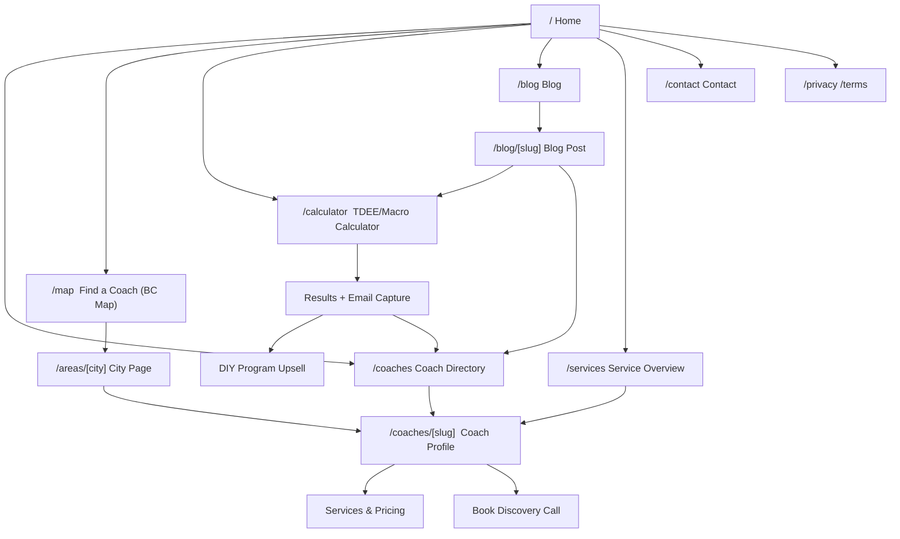
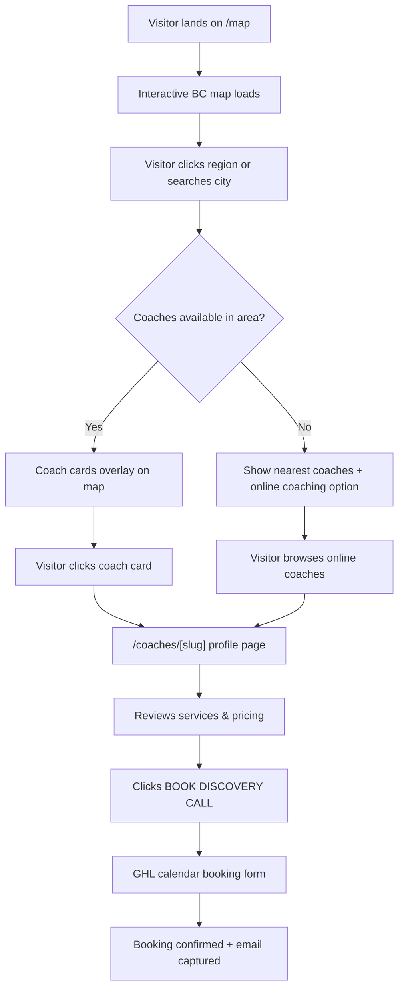
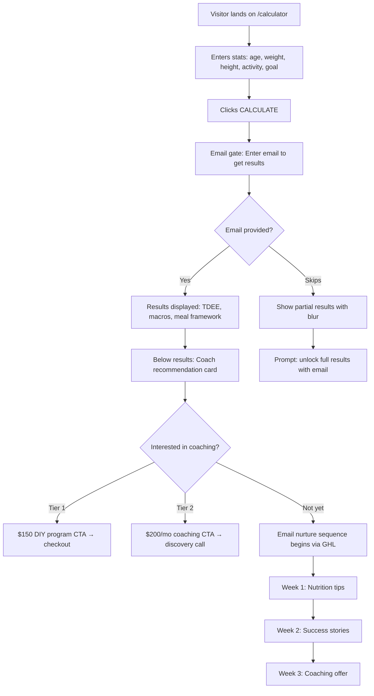
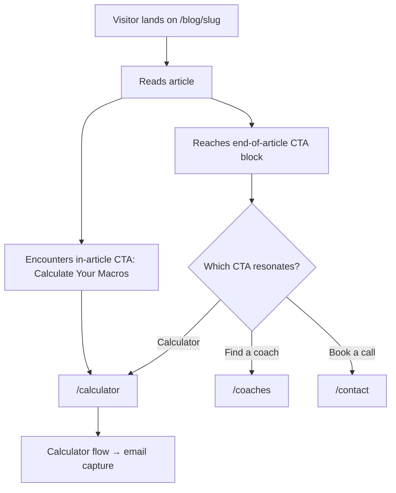
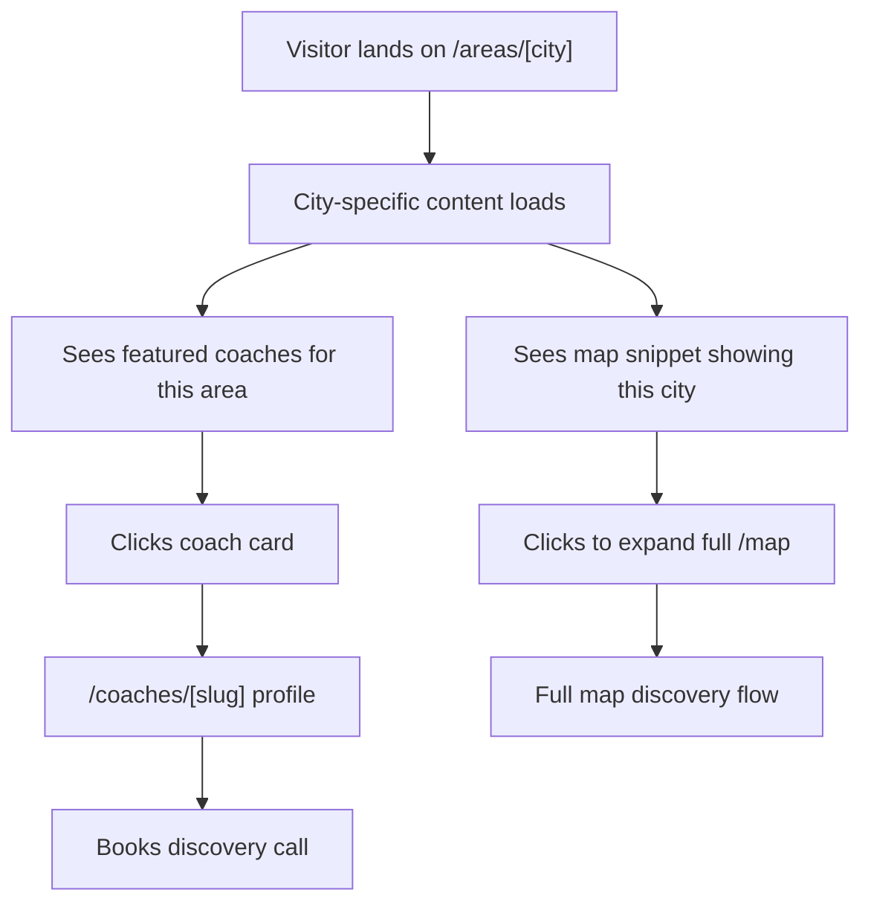

# Eccentric Iron Fitness v2 — UI/UX Specification

**Last Updated:** March 15, 2026
**Phase:** Design (SOP Phase 3)
**Design Direction:** Raw Industrial Brutalist
**Agent:** Sally (UX Expert)

---

## 1. Introduction

This document defines the user experience goals, information architecture, user flows, and visual design specifications for Eccentric Iron Fitness v2's user interface. It serves as the foundation for visual design and frontend development, ensuring a cohesive and user-centered experience.

### 1.1 Overall UX Goals & Principles

#### Target User Personas

1. **The Self-Starter** — Budget-conscious, motivated person looking for a structured fat loss plan they can execute alone. Lands via calculator or blog SEO. Converts to Tier 1 ($150 DIY). Values: simplicity, no BS, clear instructions.

2. **The Accountability Seeker** — Wants to lose fat but has failed with gym-hopping and app-tracking. Needs a real human coach. Lands via city page or coach profile. Converts to Tier 2 ($200/mo coaching). Values: personal connection, proven system, weekly check-ins.

3. **The Local Explorer** — Searching "personal trainer near me" or browsing the map. Wants to see who's available in their area of BC, compare specialties, and book a discovery call. Values: proximity, credentials, transparent pricing.

4. **The Specialty Seeker** — Has a specific need (menopause training, body recomp, pain-free training). Finds a coach through niche keyword SEO. Values: specialist expertise, understanding of their unique situation.

#### Usability Goals

- **Instant clarity:** Visitor understands what EIF is and how to find their coach within 5 seconds of landing
- **Two-click discovery:** From homepage → map or coach list → individual coach profile in 2 clicks max
- **Calculator conversion:** TDEE/Macro calculator captures email before delivering results (lead magnet flow)
- **Zero confusion pricing:** Every coach's tiers and pricing visible without scrolling or clicking "contact for pricing"
- **Mobile-first brutalism:** Raw industrial design that still works perfectly on phone screens

#### Design Principles

1. **Raw over polished** — Exposed structure, visible grid, no decorative fluff. The design should feel like a gym, not a spa.
2. **Information density over white space** — Pack useful content into the viewport. Brutalism respects the visitor's time.
3. **Bold hierarchy** — Massive headings, stark contrast, monospace accents. The eye knows exactly where to go.
4. **Transparency as trust** — Pricing, philosophy, and coach credentials are front and center, never hidden behind forms.
5. **Platform, not portfolio** — Every design decision supports multi-coach scalability. No Carver-specific branding baked into core layout.

#### Change Log

| Date | Version | Description | Author |
|------|---------|-------------|--------|
| 2026-03-15 | 1.0 | Initial UI/UX specification | Sally (UX Expert) |

---

## 2. Information Architecture (IA)

### 2.1 Site Map / Screen Inventory



### 2.2 Navigation Structure

**Primary Navigation (Top Bar — persistent, brutalist):**

| Position | Label | Route | Notes |
|----------|-------|-------|-------|
| Left | **ECCENTRIC IRON** | `/` | Logo/wordmark, monospace, always visible |
| Center-Right | **COACHES** | `/coaches` | Directory listing |
| Center-Right | **MAP** | `/map` | BC interactive map |
| Center-Right | **CALCULATOR** | `/calculator` | Lead magnet — prominent CTA styling |
| Center-Right | **BLOG** | `/blog` | Content hub |
| Far Right | **[BOOK A CALL]** | `/contact` | Primary CTA button — cyan accent |

**Mobile Navigation:**
- Hamburger menu (3 horizontal lines, thick brutalist strokes)
- Full-screen overlay on open — dark background, large monospace nav links stacked vertically
- **BOOK A CALL** stays visible outside the hamburger as a persistent CTA

**Secondary Navigation:**
- Coach Profile pages get a sticky sub-nav: `About | Services | Pricing | Book`
- Blog gets category filters as a horizontal scrollable tag bar
- City pages get a "Coaches in [City]" section linking to relevant profiles

**Breadcrumb Strategy:**
- Minimal — only on deep pages: `Home > Coaches > Carver Lloyd` or `Home > Areas > Maple Ridge`
- Monospace, small, top-left — brutalist utility style, not decorative

**Footer:**
- Minimal grid layout: Contact info | Quick links | Legal | Social
- Dark background, monospace type, no fluff

---

## 3. User Flows

### 3.1 Flow 1: Map Discovery → Coach Booking

**User Goal:** Find a local in-person coach in their area of BC

**Entry Points:** Homepage MAP nav link, Google search "personal trainer [city] BC", city page SEO landing

**Success Criteria:** Visitor clicks through to a coach profile and books a discovery call



**Edge Cases & Error Handling:**
- No coaches in selected area → Show nearest available coaches + "Online coaching available province-wide" message
- Map fails to load → Fallback to `/coaches` directory with city filter dropdown
- Coach has no availability → Show "Waitlist" option instead of booking form

### 3.2 Flow 2: Calculator Lead Magnet → Email Capture → Coaching Upsell

**User Goal:** Calculate their TDEE/macros for fat loss

**Entry Points:** Google search "tdee calculator", "macro calculator canada", blog post CTA, homepage link

**Success Criteria:** Visitor completes calculator, provides email, receives results + enters nurture sequence



**Edge Cases & Error Handling:**
- Invalid inputs (negative weight, unrealistic stats) → Inline validation with specific messages
- Email already exists in GHL → Skip duplicate, still show results, tag as "returning"
- Calculator page load without JavaScript → SSR fallback showing static explanation + email signup

### 3.3 Flow 3: Blog SEO → Calculator Funnel

**User Goal:** Learn about fat loss, macros, or nutrition

**Entry Points:** Google search "counting macros for beginners", "how to lose weight counting macros", social media links

**Success Criteria:** Reader clicks through to calculator, provides email



**Edge Cases:**
- Blog post with no related calculator topic → CTA shifts to "Find a Coach" instead
- Visitor bouncing quickly → Exit-intent popup with calculator CTA (mobile: scroll-triggered banner)

### 3.4 Flow 4: City Page SEO → Local Coach Discovery

**User Goal:** Find a personal trainer in their specific city

**Entry Points:** Google search "personal trainer maple ridge", "fitness coach langley BC"

**Success Criteria:** Visitor finds a relevant coach and books a call



**Edge Cases:**
- City has no in-person coaches → Show online coaches with "Serving [City] remotely" messaging
- City page for area not yet in keyword research → 404 with redirect to `/map`

### 3.5 Flow 5: Direct Coach Profile Visit

**User Goal:** Evaluate a specific coach (arrived via referral, social media, or internal link)

**Entry Points:** Direct URL, social media bio link, referral share link

**Success Criteria:** Visitor understands the coach's specialties, pricing, and books a call

```mermaid
graph TD
    A["/coaches/[slug]"] --> B[Hero: Coach photo + name + specialty tagline]
    B --> C[Sticky sub-nav: About | Services | Pricing | Book]
    C --> D[Scrolls through credentials, philosophy, approach]
    D --> E[Reads testimonials]
    E --> F[Reaches service tiers with pricing]
    F --> G{Which tier?}
    G -->|Tier 1 DIY| H["$150 one-time → checkout"]
    G -->|Tier 2 Coached| I["$200/mo → Book discovery call"]
    G -->|Not ready| J[Email capture: Get free macro guide]
```

**Edge Cases:**
- Coach profile with no photo yet → Placeholder with initials in brutalist style block
- Coach has paused availability → "Currently full — join waitlist" replaces booking CTA
- No testimonials yet → Placeholder card with dashed border: "Testimonial coming soon"

---

## 4. Wireframes & Key Screen Layouts

**Primary Design Files:** To be created in v0/Lovable after this spec is approved.

### 4.1 Homepage (`/`)

**Purpose:** Establish brand identity, communicate platform value, route visitors to their conversion path.

**Key Elements:**
- Hero with massive brutalist typography, two primary CTAs (Map + Calculator)
- "How It Works" — 3-step numbered process strip
- Coach preview cards with thick borders, photos (or placeholders), starting price
- Full-width calculator CTA banner (cyan background block)
- Minimal footer grid

**Interaction Notes:**
- Hero CTAs have hover state: background fills solid cyan, text inverts to dark
- Coach cards: thick black border, slight offset shadow on hover (brutalist drop shadow)
- Calculator banner is a full-bleed color block breaking the page rhythm

### 4.2 Interactive Map (`/map`)

**Purpose:** Let visitors discover in-person coaches by geographic area across BC.

**Key Elements:**
- Full-width interactive map (Mapbox GL JS) with BC boundaries
- Clickable regions/pins showing coach service areas
- Legend: In-Person / Online / Both filter toggle
- Search bar below map for city/postal code lookup
- Coach result cards appear below map when region selected
- Fallback messaging for areas with no coaches + online coaching redirect
- "Apply" CTA for coaches interested in joining the platform

**Interaction Notes:**
- Map regions highlight with cyan (`#2DDBDB`) on hover
- Clicking a region zooms in and filters coach cards below
- Search auto-completes BC city names
- On mobile: map takes 50% viewport height, coach cards appear in bottom sheet (slide-up panel)

### 4.3 Coach Profile (`/coaches/[slug]`)

**Purpose:** Showcase individual coach — credentials, philosophy, testimonials, services, pricing — and convert to booking or purchase.

**Key Elements:**
- Hero with coach photo (thick bordered frame or placeholder with initials), name, specialty, location
- Sticky sub-nav scrolls with the page (About | Services | Pricing | Book)
- Credentials as a minimal bullet list
- Approach section — short, punchy, philosophy-driven copy
- Testimonials section — client quotes with attribution, placeholder cards for upcoming testimonials
- Side-by-side pricing tiers with clear differentiation
- Scarcity indicator for limited spots
- Mini map snippet showing areas served
- Two distinct CTAs per tier (purchase vs. book call)

**Interaction Notes:**
- Sticky sub-nav highlights active section on scroll
- Tier cards: hover lifts with brutalist offset shadow
- "ONLY X SPOTS LEFT" — dynamic if connected to GHL, static fallback otherwise
- Mini map is non-interactive, links to full `/map` on click

### 4.4 TDEE/Macro Calculator (`/calculator`)

**Purpose:** Lead magnet — deliver value (macro calculation), capture email, upsell coaching.

**Key Elements:**
- Clean input form with brutalist field styling (thick borders, monospace labels)
- Toggle switches for unit preference (metric/imperial)
- Single large CTA button (full-width, filled cyan)
- Email gate modal appears after CALCULATE click, before results display
- Results section: large numbers, visual macro bars, Cook→Measure→Eat explanation
- Below results: coaching upsell with both tiers

**Interaction Notes:**
- Form inputs have thick bottom-border focus state (cyan), no rounded corners
- Activity/Goal dropdowns are custom-styled brutalist selects
- Macro bars animate on reveal (left-to-right fill, Framer Motion)
- Email gate is a centered modal with dark overlay, single email field + submit

### 4.5 Blog Landing (`/blog`)

**Purpose:** Content hub for SEO traffic — articles on fat loss, macros, nutrition. Funnels to calculator.

**Key Elements:**
- Category filter bar (horizontal scrollable tags)
- Featured post with large image (or placeholder) + title
- Grid of post cards (2-column desktop, 1-column mobile)
- Each card: image (or placeholder), title, date, read time, category tag
- Load more button (not infinite scroll — brutalist = deliberate actions)

---

## 5. Component Library / Design System

**Design System Approach:** Custom brutalist system built on Tailwind CSS 4 utility classes. No pre-built UI library (no shadcn, no Radix). Every component is purpose-built to enforce the raw industrial aesthetic. Components are platform-agnostic — they work for any coach.

### Core Components

#### 5.1 `BrutalistButton`

**Purpose:** Primary interactive element across all pages.

| Variant | Style | Usage |
|---------|-------|-------|
| `primary` | Solid cyan (`#2DDBDB`) bg, dark text, 3px black border | Main CTAs |
| `secondary` | Transparent bg, 3px black border, dark text | Secondary actions |
| `inverse` | Solid navy (`#455590`) bg, white text, 3px black border | Dark section CTAs |
| `ghost` | No border, underline on hover, monospace | Tertiary links |

**States:** Default → Hover (4px offset shadow, translate -2px up) → Active (shadow collapses) → Disabled (grayscale) → Focus (cyan outline, 3px offset)

**Rules:** Always uppercase monospace. Min 48px height. Never rounded. Arrow (`→`) on nav CTAs.

#### 5.2 `CoachCard`

**Purpose:** Reusable card for displaying a coach in any context.

| Variant | Usage |
|---------|-------|
| `featured` | Homepage — large photo, full details, starting price |
| `compact` | Map results, city page listings — horizontal layout |
| `minimal` | Blog sidebar, footer — name + specialty only |

**States:** Default → Hover (4px offset shadow, border thickens to 4px) → Focus (cyan outline)

**Rules:** Photo always has 3px black border. Name always uppercase monospace. "FROM $X" always visible. No photo → initials in solid navy block.

#### 5.3 `MapContainer`

**Purpose:** Interactive BC map for coach discovery.

| Variant | Usage |
|---------|-------|
| `full` | `/map` page — full width, interactive, with legend and search |
| `snippet` | Coach profile — small, non-interactive, shows service area only |

**Rules:** Mapbox GL JS with custom brutalist style. Service area polygons: cyan fill 30% opacity, 2px cyan border. Square pins (not round). Always include no-JS fallback.

#### 5.4 `PricingTier`

**Purpose:** Display service tier with pricing, features, and CTA.

| Variant | Usage |
|---------|-------|
| `standard` | Side-by-side comparison on coach profile |
| `highlighted` | Recommended tier — thicker border + cyan accent bar |
| `standalone` | Single tier in upsell contexts |

**Rules:** Price is the largest text after tier name. Features use `▪` included, `✗` excluded. Scarcity badge is solid cyan block. Never hide pricing.

#### 5.5 `FormField`

**Purpose:** Input fields for calculator, contact form, email capture, search.

| Variant | Usage |
|---------|-------|
| `standard` | Text input — thick bottom border, no box border |
| `select` | Custom dropdown — brutalist styled |
| `toggle` | Binary choice — filled block vs outline block |
| `search` | Search bar with integrated submit |

**States:** Empty → Focus (border turns cyan, label floats) → Filled → Error (red border + message) → Disabled

**Rules:** Labels uppercase monospace, above field. No rounded corners. Error messages in monospace red.

#### 5.6 `SectionDivider`

| Variant | Usage |
|---------|-------|
| `line` | 1px rule between content blocks |
| `heavy` | 3px rule between major sections |
| `titled` | Rule with section title + `═══` underline |
| `color-break` | Full-bleed background color change |

#### 5.7 `Tag`

| Variant | Style |
|---------|-------|
| `default` | 2px black border, transparent bg, monospace |
| `filled` | Solid navy bg, white text |
| `accent` | Solid cyan bg, dark text |

#### 5.8 `EmailCapture`

| Variant | Usage |
|---------|-------|
| `modal` | Calculator email gate — centered overlay |
| `inline` | Blog CTA, footer signup |
| `banner` | Full-width color block with email field |

**Rules:** Single field (email only). Modal: dark overlay 80%, not closable by clicking outside. Success state swaps to confirmation.

#### 5.9 `NavBar`

| Variant | Usage |
|---------|-------|
| `desktop` | Horizontal bar — logo left, links center-right, CTA far right |
| `mobile` | Logo + persistent CTA + hamburger → full-screen overlay |

**Rules:** "ECCENTRIC IRON" in monospace, no icon. CTA always visible on mobile. Hamburger: three thick 3px lines.

#### 5.10 `Footer`

Single variant — 3-column grid desktop, stacked mobile. Dark bg, monospace, social links as text labels (not icons).

#### 5.11 `TestimonialCard`

**Purpose:** Display client testimonials on coach profiles.

| Variant | Usage |
|---------|-------|
| `full` | Coach profile — quote, attribution (name + location), optional stats |
| `compact` | Homepage or sidebar — short quote, name only |
| `placeholder` | Empty state — "Testimonial coming soon" with dashed border |

**Rules:** Quote in Inter italic. Attribution in monospace uppercase. Large `"` as decorative element (navy/cyan). 3px left border (cyan). Placeholder uses dashed 2px border.

### Image Placeholders

| Context | Placeholder Style |
|---------|------------------|
| Coach photo | Solid navy block with white monospace initials, 3px black border |
| Blog hero | Solid dark block with monospace label "HERO IMAGE" + category tag |
| Blog thumbnail | Smaller navy block with "THUMB" label |
| Testimonial avatar | Small square (48px) navy block with initials |
| Map fallback | Static grayscale BC outline on dark background |
| Generic/missing | Solid `#1A2035` block with Lucide `ImageOff` icon at 40% opacity |

---

## 6. Branding & Style Guide

### Visual Identity

**Brand Direction:** Raw Industrial Brutalist — the design should feel like a gym built from concrete and steel, not a wellness spa. Every visual choice prioritizes honesty, directness, and strength.

### Color Palette

| Color Type | Hex | RGB | Usage |
|-----------|-----|-----|-------|
| **Primary (Navy)** | `#455590` | 69, 85, 144 | Headers, filled blocks, placeholders, inverse buttons |
| **Secondary (Cyan)** | `#2DDBDB` | 45, 219, 219 | CTAs, hover states, active indicators, map highlights |
| **Accent (Orange)** | `#FF6B35` | 249, 107, 53 | Scarcity badges, urgency — max 1 per page |
| **Success** | `#22C55E` | 34, 197, 94 | Form success states, availability |
| **Warning** | `#F7931E` | 247, 147, 30 | Cautions, "spots filling up" |
| **Error** | `#EF4444` | 239, 68, 68 | Form validation errors |
| **Dark BG** | `#111827` | 17, 24, 39 | Primary background |
| **Darker BG** | `#0A0E1A` | 10, 14, 26 | Nav bar, overlays, modals |
| **Card Surface** | `#1A2035` | 26, 32, 53 | Card backgrounds on dark bg |
| **Border** | `#2A3050` | 42, 48, 80 | Subtle borders on dark bg |
| **Border Hard** | `#000000` | 0, 0, 0 | Brutalist thick borders (3-4px) |
| **Text Primary** | `#FFFFFF` | 255, 255, 255 | Headings, body text on dark bg |
| **Text Secondary** | `#9CA3AF` | 156, 163, 175 | Metadata, timestamps |
| **Text Muted** | `#6B7280` | 107, 114, 128 | Disabled states, placeholders |

**Color Rules:**
- Cyan = action color (if it's cyan, it's clickable)
- Navy fills large blocks (headers, placeholders, section backgrounds)
- Orange is scarcity only — never decorative, max one per viewport
- Dark background is default — light sections are exceptions
- **No gradients anywhere** — solid fills only (old site gradient is retired)

### Typography

#### Font Families

| Role | Font | Fallback | Usage |
|------|------|----------|-------|
| **Primary** | Space Grotesk | Arial Black, sans-serif | Headings, nav, CTAs, prices |
| **Secondary** | Inter | Helvetica Neue, sans-serif | Body text, descriptions, forms |
| **Monospace** | JetBrains Mono | Courier New, monospace | Tags, metadata, breadcrumbs, stats |

#### Type Scale

| Element | Desktop | Mobile | Weight | Line Height | Transform |
|---------|---------|--------|--------|-------------|-----------|
| H1 | 4.5rem (72px) | 2.5rem (40px) | 800 | 1.0 | UPPERCASE |
| H2 | 3rem (48px) | 2rem (32px) | 700 | 1.1 | UPPERCASE |
| H3 | 1.875rem (30px) | 1.5rem (24px) | 700 | 1.2 | UPPERCASE |
| H4 | 1.25rem (20px) | 1.125rem (18px) | 600 | 1.3 | UPPERCASE |
| Body | 1.125rem (18px) | 1rem (16px) | 400 | 1.6 | Normal |
| Body Small | 0.875rem (14px) | 0.875rem (14px) | 400 | 1.5 | Normal |
| Mono Label | 0.75rem (12px) | 0.75rem (12px) | 500 | 1.4 | UPPERCASE |
| Price Large | 3rem (48px) | 2rem (32px) | 800 | 1.0 | Normal |

**Typography Rules:**
- ALL headings uppercase — no exceptions
- Body text never uppercase
- Monospace always small and uppercase — accent only
- Tight line heights on headings (1.0-1.2), generous on body (1.6)

### Iconography

**Library:** Lucide React

**Rules:**
- Icons are supplementary, never primary — text labels always present
- Stroke weight: 2px, Size: 20px standard
- Color inherits text color — never multi-colored
- Exceptions (icon alone): hamburger, close (X), arrow (→), external link
- No emoji, no decorative icons

### Spacing & Layout

**Grid:** 12-column (desktop), 4-column (tablet), 1-column (mobile). Max-width: 1280px centered. Gutter: 24px (desktop), 16px (mobile).

**Spacing Scale (4px base):**

| Token | Value | Usage |
|-------|-------|-------|
| `space-1` | 4px | Between icon and label |
| `space-2` | 8px | Between related items |
| `space-3` | 12px | Form field padding |
| `space-4` | 16px | Between components in a group |
| `space-6` | 24px | Between sections within a card |
| `space-8` | 32px | Between cards in a grid |
| `space-12` | 48px | Between major page sections |
| `space-16` | 64px | Hero to first content |
| `space-24` | 96px | Page top/bottom padding |

**Layout Rules:**
- **Zero border-radius everywhere** — enforced via Tailwind config
- **3px minimum borders** for component outlines, 1px for subtle dividers
- **Offset shadows:** `4px 4px 0px #000` (no blur)
- **Full-bleed sections** break the grid for visual rhythm
- **Asymmetric layouts encouraged** — left-aligned with exposed space

---

## 7. Accessibility Requirements

### Compliance Target

**Standard:** WCAG 2.1 AA

### Key Requirements

**Visual:**
- Color contrast: 4.5:1 body text, 3:1 large text
  - White on Dark BG (#111827) = 15.4:1 (passes)
  - Cyan on Dark BG = 8.6:1 (passes)
  - Navy on White = 5.2:1 (passes)
  - Text Secondary on Dark BG = 4.7:1 (passes AA)
- Focus indicators: 3px cyan outline offset 2px on all interactive elements
- Text sizing: 16px minimum base, scales to 200% without breaking

**Interaction:**
- Full keyboard navigation with visible tab order
- Map: arrow keys to pan, +/- zoom, Enter to select, skip-to-content link
- Screen readers: `alt` text on all images, `aria-label` on map regions, `aria-live="polite"` on dynamic content, `aria-labelledby` on pricing tiers
- Touch targets: 48x48px minimum, 8px gap between adjacent targets

**Content:**
- Coach photos: "Photo of [Name], [Specialty] at Eccentric Iron Fitness"
- Placeholder images: `alt=""` (decorative)
- Strict heading hierarchy (H1→H2→H3), one H1 per page
- Every form input has visible `<label>` with `for`/`id` association

### Testing Strategy

- **Automated:** axe-core in CI, Lighthouse accessibility audit on every build
- **Manual:** Keyboard-only nav test, screen reader test (NVDA/VoiceOver) for coach profile and calculator
- **Ongoing:** Color contrast checks when adding new content

---

## 8. Responsiveness Strategy

### Breakpoints

| Breakpoint | Min | Max | Target | Columns |
|-----------|-----|-----|--------|---------|
| Mobile | 0px | 639px | Phones (portrait) | 1 |
| Mobile Landscape | 640px | 767px | Phones (landscape) | 2 |
| Tablet | 768px | 1023px | iPad, tablets | 4 |
| Desktop | 1024px | 1279px | Laptops | 12 |
| Wide | 1280px | — | Large desktops | 12 (max-w centered) |

### Adaptation Patterns

**Layout:**
- Coach cards: 2-col → 1-col below 768px
- Pricing tiers: side-by-side → stacked below 768px (recommended tier shows first on mobile)
- Blog grid: 2-col → 1-col below 640px
- Full-bleed sections maintained at all sizes

**Navigation:**
- Below 1024px: hamburger with full-screen overlay
- "BOOK A CALL" always visible on mobile outside hamburger
- Coach sub-nav: horizontal scroll on mobile

**Content Priority (Mobile):**
- Homepage: Hero CTAs stack vertically → Coach cards → Calculator banner
- Map: 50% viewport height → search → bottom sheet for coach cards
- Coach profile: Photo + name → Testimonials → Pricing → Approach → Credentials (reordered for conversion)
- Calculator: linear (no reordering needed)

**Interaction:**
- Map: pinch-to-zoom, tap instead of hover, bottom sheet for results
- Hover effects become tap-active states
- Offset shadows: 4px → 2px on mobile
- Testimonials: horizontal swipe carousel on mobile

---

## 9. Animation & Micro-interactions

### Motion Principles

Brutalist motion is **deliberate and mechanical** — no bounce, no playfulness. Animations feel like industrial machinery: precise, functional, with weight. Every animation serves a purpose.

### Key Animations

| Animation | Element | Duration | Easing |
|-----------|---------|----------|--------|
| Page enter | Content fade in | 300ms | ease-out |
| Section reveal | Slide up 20px + fade on scroll | 400ms | ease-out |
| Button hover | Translate -2px Y, shadow grows | 150ms | ease-in-out |
| Button press | Translate back, shadow collapses | 100ms | ease-in |
| Card hover | Translate -2px Y, shadow grows | 150ms | ease-in-out |
| Map region hover | Fill opacity 0→30% cyan | 200ms | linear |
| Map zoom | Smooth zoom to region | 500ms | ease-in-out |
| Mobile bottom sheet | Slide up from bottom | 300ms | ease-out |
| Nav overlay | Fade overlay + slide links from right | 250ms | ease-out |
| Macro bars | Width 0%→target% (staggered) | 600ms | ease-out |
| Email gate modal | Fade + scale 95%→100% | 200ms | ease-out |
| Form focus | Border color transition | 150ms | linear |
| Success state | Content crossfade | 300ms | ease-in-out |
| Testimonial swipe | Horizontal slide with momentum | 300ms | ease-out |

**What we DON'T animate:**
- No parallax scrolling
- No background animations or floating elements
- No loading spinners (skeleton pulse instead)
- No text animations
- No hover transitions on text links (instant change)

**Framer Motion:** `motion.div` for reveals, `AnimatePresence` for modals/pages, `whileHover`/`whileTap` for interactions, `useReducedMotion()` to respect OS settings.

---

## 10. Performance Considerations

### Performance Goals

| Metric | Target |
|--------|--------|
| LCP | < 2.5s |
| CLS | < 0.1 |
| INP | < 200ms |
| FCP | < 1.5s |
| TTI | < 3.5s |
| JS Bundle | < 200KB gzipped |

### Design Strategies

**Fonts:** `font-display: swap`, preload Space Grotesk Bold in `<head>`, system fallbacks prevent CLS.

**Images:** Next.js `<Image>` for WebP/AVIF, responsive `srcset`, lazy loading. Coach photos max 400x400. Placeholders render instantly (no CLS).

**Map:** Mapbox loaded via `next/dynamic` with `ssr: false`. Custom minimal tile style. Geojson loaded on demand.

**Code Splitting:** Route-based (App Router default). Mapbox dynamic import. Framer Motion tree-shaken.

**Caching:** Static pages ISR 1-hour revalidation. Coach profiles ISR 15-minute. Map data service worker cached.

**SEO:** All pages SSR/SSG. JSON-LD structured data server-side. Auto-generated sitemap.

---

## 11. Next Steps

### Immediate Actions

1. Save this spec to v2 project docs
2. Switch to Architect agent — create technical architecture doc (folder structure, data models, API routes, Supabase schema, Mapbox integration)
3. Create PRD — PM agent formalizes requirements into epics and stories
4. Generate AI frontend prompts — create v0/Lovable-ready prompts from wireframes
5. Dev agent — implementation
6. QA agent — testing + launch audit
7. Analyst agent — coach discovery (ongoing, repeatable process for each new coach)

### Design Handoff Checklist

- [x] All user flows documented (5 flows)
- [x] Component inventory complete (11 components)
- [x] Accessibility requirements defined (WCAG 2.1 AA)
- [x] Responsive strategy clear (5 breakpoints)
- [x] Brand guidelines incorporated (brutalist palette, typography, layout rules)
- [x] Performance goals established (Core Web Vitals targets)
- [x] Image placeholder system defined
- [x] Testimonial component specified
